<h1 style="text-align: center;">Rodamorzar</h1>

# 1 Introduccion 

Rodasmorzar es una aplicación que une dos pasiones: el ciclismo y la gastronomía. Nuestra misión es hacer que cada trayecto en bicicleta sea más que una actividad física, permitiendo a los ciclistas descubrir nuevos lugares para disfrutar de un buen almuerzo o merienda. A través de nuestra app, los usuarios pueden encontrar rutas para recorrer y los mejores sitios para disfrutar de una pausa gastronómica.

## Esquema Rodasmorzar

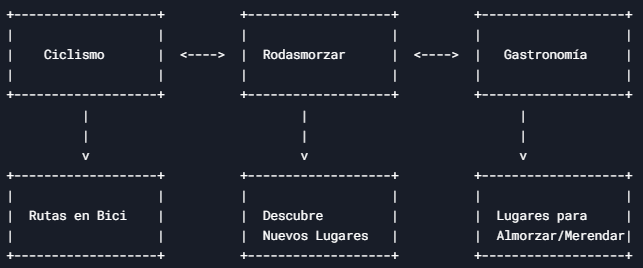

## 2. Funcionalidades Principales

- **Búsqueda de rutas y lugares gastronómicos**:  
  Los usuarios pueden buscar rutas ciclistas y descubrir lugares gastronómicos cercanos en su recorrido.

- **Perfil del usuario**:  
  - Guardar rutas favoritas.  
  - Recibir recomendaciones personalizadas basadas en sus preferencias y actividad.  

- **Integración con mapas y GPS**:  
  La aplicación utiliza mapas y GPS para guiar a los usuarios en tiempo real, mostrando rutas óptimas y lugares para comer.
- Diagrama
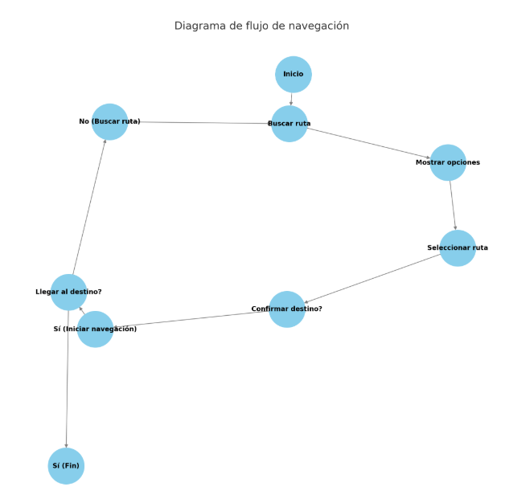

## 3.Diagramas de flujo
### Server
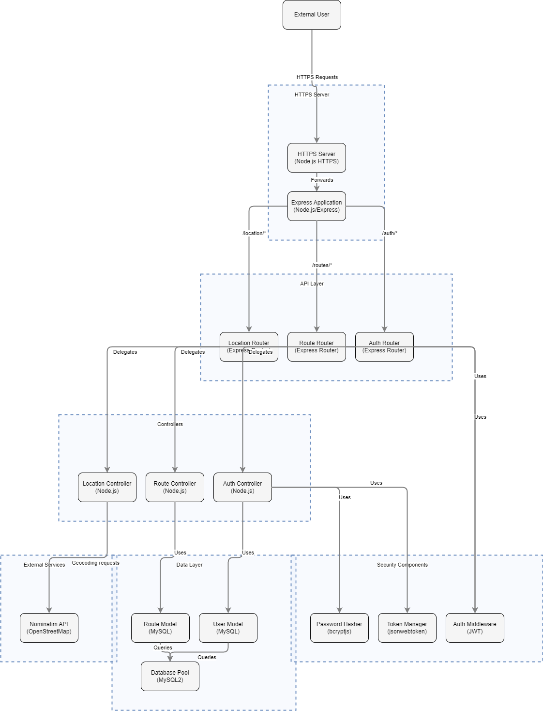  
### Aplicacion
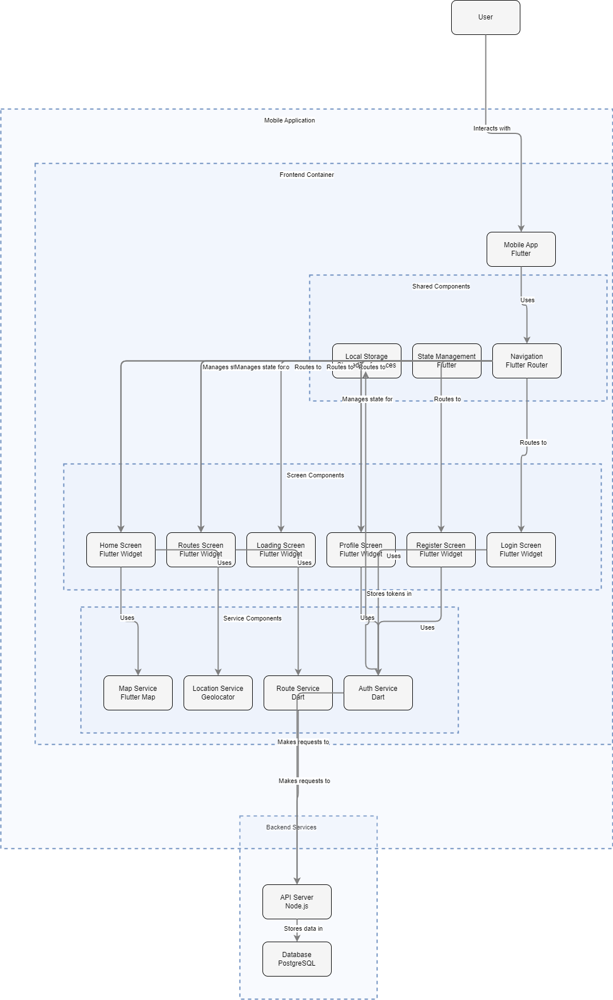  
### Escritorio
  

## 4. ¿Cómo Funciona la Aplicación? 
- **Demostracion**
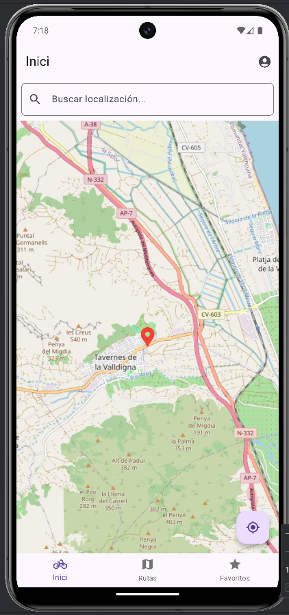  
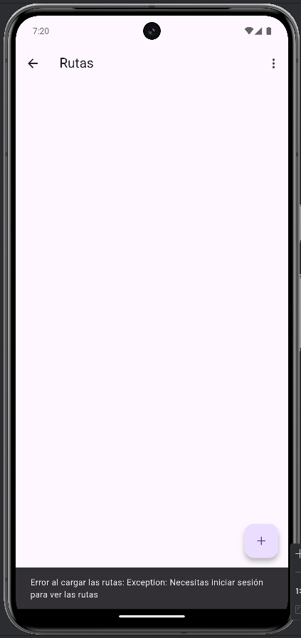  
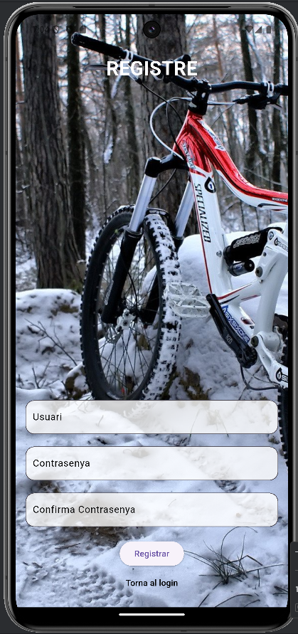  
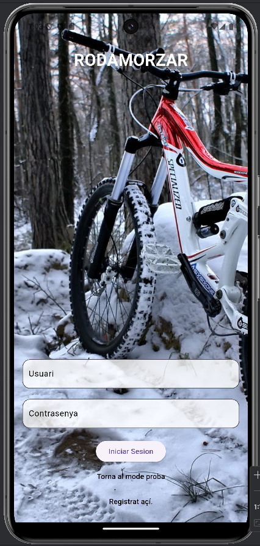  
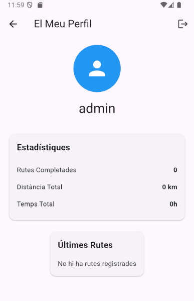  
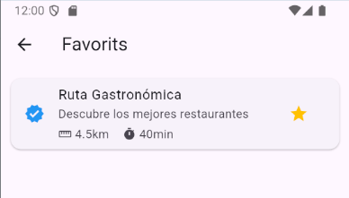  

## 5.Beneficios para los Usuarios

- **Comodidad**:
    Facilita la búsqueda de lugares y rutas.
- **Aventura**: 
Combina ejercicio y exploración.
- **Red social**:
 Oportunidades de compartir experiencias.

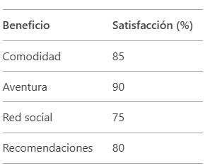

## 6. ¿Por Qué Elegir Rodasmorzar?
A diferencia de otras aplicaciones de ciclismo o mapas, Rodasmorzar va un paso más allá, combinando la actividad física con el disfrute gastronómico. No solo te ayuda a planificar rutas, sino que también te permite descubrir los mejores lugares donde comer durante el camino, lo cual hace de cada salida una experiencia única.
